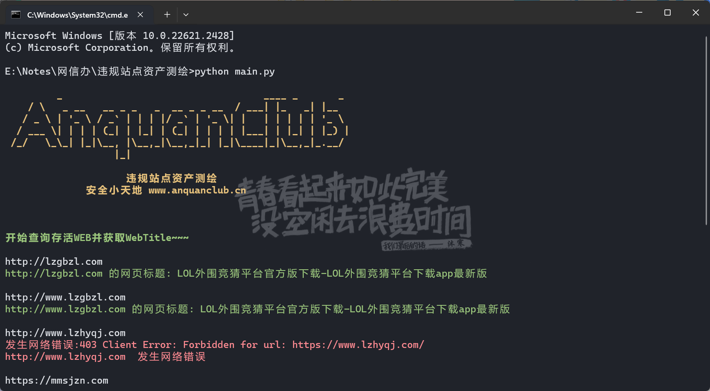
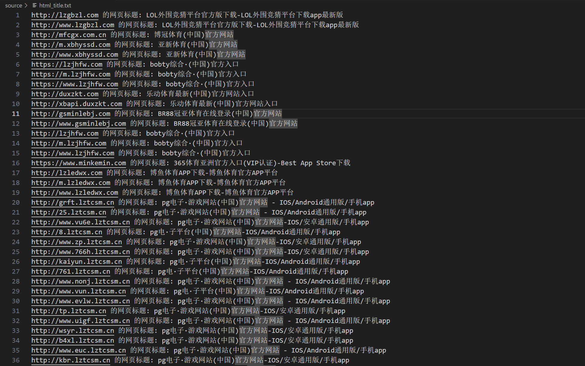
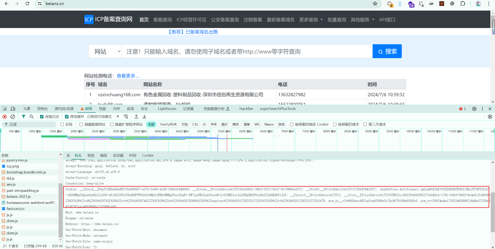
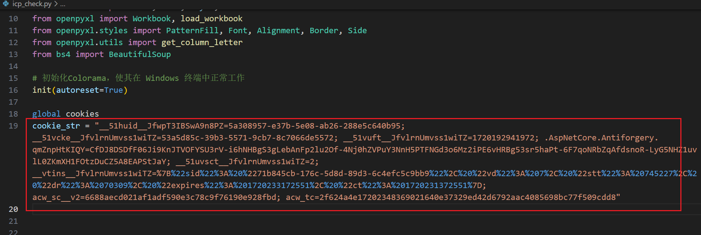

## 网信办查询违规站点小工具
### 使用
将需要进行检测的url放在source目录下面的urls.txt文件中  

运行main.py即可  

  

### 脚本思路
+ 导入违规词url
+ 检查url存活
+ 判断是否存在备案
+ 根据备案反查title，确定违规站点

### cookie设置
如果一直备案查询失败
修改icp_check里面的cookie_str字符

### 后续更新
1. 匹配查询机制,多次查询得到ip被ban的提示，然后自动更换代理地址
2. 全部查询完之后从excal中提取所有存在备案域名的Webtitle